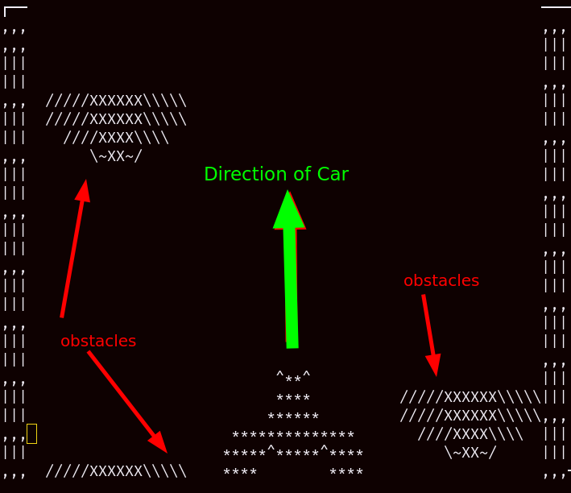
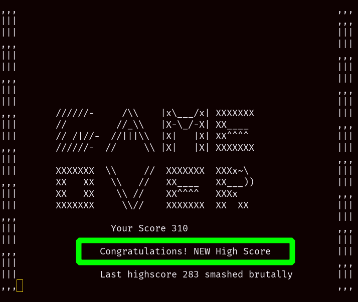

# The Car game - don't get wrecked!

### Table of contents
* [Introduction](#introduction)
* [How to play the game](#how-to-play-the-game)
* [Execution method](#execution-method)
* [Few Screenshots](#few-screenshots)
* [Contact developer](#contact-developer)

## Introduction
 This Project is a realization of an old game I used to play in a handheld video-game device as a child. 
 * This simple game is created using `ncurses.h` library of C on the `LINUX` OS.
 * This involves multithreading using `pthreads`(POSIX threads) library in C.
 * There are threads running in parallel to- 
    * keep the fences running to create and illusion of car moving ahead
    * use a Randomized algorithm to generate obstacles
    * calculate the score
    * listen to keyboard inputs
    * refresh the page to re-render the car at new location
___
## How to play the game
* Press `A` and `D` for left and right movements respectively
* Change lanes to make sure you don't get wrecked by the obstacles for as long as possible.
* The longer you stay on the roads, the higher the score.
Keep breaking highscores!!
___

## Execution method:
To execute the `main_experiment.c`
  * `cd` into the project directory and run
    > `make`
  * Then run
    > `./exp`
___

## Few Screenshots:
* Basic set up of the game

* Gameover and highscore page

## Contact developer
                
#### Animesh Kumar

email: 24animesh11@gmail.com 

phone: +91 7985851496 
